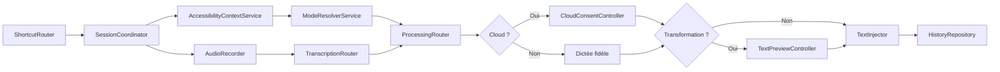

# Architecture de Pressay

Ce document décrit le socle réellement présent dans la branche de
développement. Les actions, intégrations, réunions et le stockage SQLite
décrits dans `ROADMAP.md` restent des extensions planifiées.

## Principes

- `AppState` adapte l’état métier à SwiftUI ; il ne porte plus le pipeline.
- Une `VoiceSession` conserve l’intention, la cible, le contexte, le mode, les
  textes brut/final, les timings et l’état terminal.
- La cible et le contexte sont capturés au début de la session.
- Le contexte passif est toujours traité comme une donnée non fiable.
- Une transformation ne modifie jamais sa source avant un aperçu explicite.
- Une livraison qui ne peut plus prouver sa cible copie le résultat.
- Aucun contrat d’action ne donne directement accès à un exécuteur depuis une
  sortie de modèle.

## Canaux de distribution

`DistributionChannel` sépare deux produits à la compilation. Le canal
`.direct` active Accessibility, l'injection universelle, les raccourcis globaux,
les profils d'application et Sparkle. Le canal `.appStore`, construit avec la
condition `APP_STORE`, remplace ces frontières par des implémentations sans API
interapplications : capture déclenchée dans l'interface, contexte vide et
livraison par copie/Inbox.

La variante App Store n'est pas une simple configuration de signature. Son
binaire ne lie ni Sparkle ni les services AX/Carbon/CGEvent. La règle est
contrôlée par `scripts/validate-app-store.sh` afin d'éviter qu'une évolution du
canal direct réintroduise silencieusement une capacité interdite.

## Pipeline actuel



Une dictée Fidèle contourne le processeur de transformation. La transcription
utilise le moteur choisi globalement : OpenAI ou WhisperKit. Les autres modes
utilisent la Responses API OpenAI. `ProviderPolicy.localOnly` force WhisperKit
pour la transcription et échoue proprement lorsqu’une transformation cloud est
requise. `askBeforeCloud` demande un choix à chaque session ; `cloudAllowed`
affiche un disclosure initial dont la signature est invalidée si le modèle ou
les sources changent.

## Machine d’état

Le chemin nominal est :

```text
idle
  → capturing
  → captured
  → transcribing
  → processing
  → awaitingConfirmation
  → processing
  → awaitingPreview | delivering | completed
  → delivering
  → completed
```

Chaque état non terminal peut devenir `cancelled` ou `failed`. Les états
`completed`, `cancelled` et `failed` sont terminaux. La capture suivante peut
commencer pendant le traitement de la précédente ; la livraison reste
séquentielle et chaque élément de file conserve sa cible.

## Types de domaine

| Type | Responsabilité |
| --- | --- |
| `VoiceIntent` | Distinguer dictée, transformation, action, Inbox et réunion |
| `VoiceSession` | Source de vérité d’une interaction vocale |
| `TargetSnapshot` | PID, bundle, fenêtre, rôle AX, sécurité et hash initial |
| `ContextSnapshot` | Sources passives capturées et manifeste transmissible |
| `ModeDefinition` | Prompt, format, nettoyage, fournisseur et permissions |
| `ProviderPolicy` | Encadrer local, fallback et cloud |
| `ActionProposal` | Représenter une action future typée et idempotente |
| `HistoryRecord` | Modèle enrichi de persistance future |
| `CapabilityMatrix` | Décrire les capacités réelles de la machine |

Les contrats `AudioCapturing`, `SpeechTranscribing`, `TextProcessing`,
`ContextCapturing`, `ModeResolving`, `TextDelivering`,
`TextPreviewPresenting`, `ActionProposing`, `ActionExecuting`,
`HistoryRepository` et `ModelRepository` forment les frontières testables.

## Capture du contexte

`AccessibilityContextService` capture :

- l’application active et son bundle ID ;
- la fenêtre focalisée ;
- l’élément AX, son rôle et son sous-rôle ;
- le caractère modifiable ou protégé de l’élément ;
- la sélection et son hash ;
- au maximum environ 4 000 caractères de contexte adjacent.

Un champ sécurisé ne produit pas de sélection ni de contexte textuel. Si AX ne
retourne pas la sélection, la transformation tente un `Cmd+C` temporaire. Tous
les types du presse-papiers sont sauvegardés puis restaurés, sauf si
l’utilisateur l’a modifié entre-temps.

Le mode filtre ensuite le snapshot avec `allowedContextSources`. Le manifeste
cloud ne contient que les sources restantes et est affiché avant le traitement.

## Sécurité de la livraison

`TextInjector` mémorise l’application, la fenêtre, l’élément AX et la plage
initiaux. Juste avant l’insertion, il vérifie :

1. que la cible n’est pas sécurisée ;
2. que l’application initiale peut être réactivée ;
3. que la fenêtre et l’élément focalisé sont toujours les mêmes ;
4. que la plage et la sélection possèdent toujours les valeurs initiales ;
5. que l’attribut AX choisi est réellement modifiable.

L’échec d’une condition interdit le collage. Le coordinateur copie alors le
texte et avertit l’utilisateur. Quand AX fournit une plage stable, un jeton
local permet de restaurer le texte remplacé pendant huit secondes.

Les opérations temporaires `Cmd+C`/`Cmd+V` passent par un acteur unique. Il
capture tous les items et types du presse-papiers, attend une fenêtre calme de
50 ms et ne restaure que si Pressay possède toujours le `changeCount`. Une
modification concurrente de l’utilisateur est donc préservée.

## Modes et données locales

Les douze modes natifs ont des UUID stables. Les modes personnalisés, profils
par bundle ID et overrides sont enregistrés atomiquement dans `modes.json`
schéma v2, avec des permissions POSIX `0600`. La migration conserve
`modes.v1.backup` jusqu’à deux lancements v2 réussis. La priorité de résolution
est :

1. mode explicitement associé à l’invocation ;
2. mode dédié à l’intention Transformation ;
3. règle de l’application ;
4. mode choisi manuellement ;
5. mode Fidèle.

Le fichier des modes n’est pas annoncé comme chiffré. Les historiques restent
dans le stockage AES-256-GCM historique jusqu’à la migration SQLite prévue.

## Traitement cloud actuel

Avant chaque traitement cloud, `CloudConsentController` construit un
`CloudPreflight` éphémère. L’interface sépare la parole — seule instruction —
des sources passives, affiche les caractères et le contenu exact, puis expire
après 60 secondes. Seule une signature mode/fournisseur/modèle/sources peut être
conservée ; le payload ne l’est jamais.

`OpenAITextProcessingService` :

- utilise une session réseau éphémère ;
- envoie `store: false` ;
- sépare les instructions du système, la parole et les données passives ;
- ne transmet que le contexte autorisé par le mode ;
- n’agrège que les éléments `output_text` de la réponse ;
- laisse le choix du modèle de traitement dans les réglages.

`store: false` désactive la conservation de l’état de réponse ; ce réglage ne
doit pas être présenté comme une garantie générale d’absence de traitement ou
de rétention par le fournisseur.

## Transcription locale

`TranscriptionRouter` ne choisit qu’entre OpenAI et WhisperKit. Le choix est
global et explicite ; aucun fallback silencieux ne peut envoyer au cloud une
dictée prévue en local. Les politiques historiques des modes ne peuvent que
forcer le chemin local.

Pour OpenAI, `TranscriptionService` envoie le WAV 24 kHz une seule fois à
`gpt-4o-mini-transcribe` au relâchement. La requête interactive est bornée à
quatre secondes sans données et six secondes au total. Ce chemin unique évite
l’enchaînement WebSocket, timeout puis requête de repli.

`WhisperKitTranscriptionService` télécharge à la demande une seule variante
épinglée (`small_216MB`) dans `Application Support/Pressay/WhisperKit`, expose
une progression claire et conserve le modèle chargé après la première dictée.
Le téléchargement n’est jamais déclenché au milieu d’une transcription et le
modèle peut être supprimé depuis les réglages. Le moteur local est disponible
sur Apple Silicon ; la build Intel conserve OpenAI et affiche une indisponibilité
explicite pour WhisperKit.

## Extensions prévues

Les nouvelles capacités doivent implémenter les contrats existants plutôt que
réintroduire de la logique dans `AppState` :

- benchmarks avant d’ajouter d’autres moteurs locaux ;
- `HistoryRepository` SQLite chiffré et migration vérifiée ;
- contexte projet derrière security-scoped bookmarks ;
- `ActionProposal` validée par schéma puis évaluée par une politique locale ;
- exécuteurs et intégrations séparés, idempotents et révocables ;
- session Réunion et stockage dédiés.

Les critères détaillés et les gates de release sont dans
[ROADMAP.md](ROADMAP.md) et [TESTING.md](TESTING.md).
