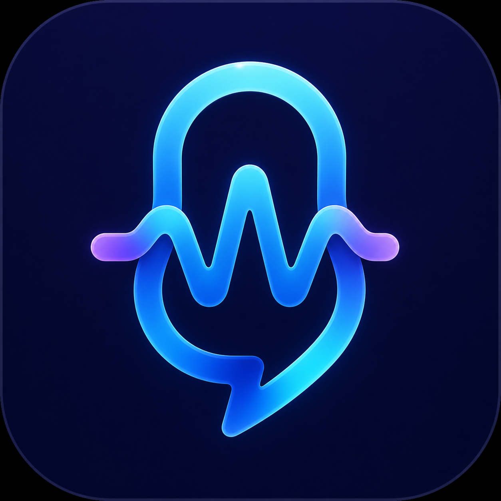

<p align="center">
  
</p>

# Whisper

Une app macOS ultra simple pour transcrire ta voix en texte, directement depuis ta barre de menu.

Maintiens la touche **Fn** enfoncée, parle, relâche, et le texte apparaît là où se trouve ton curseur. C'est tout.

## Comment ça marche ?

1. L'app vit dans ta barre de menu (en haut à droite de ton écran)
2. Tu maintiens la touche **Fn** enfoncée
3. Tu parles
4. Tu relâches **Fn**
5. Le texte transcrit est automatiquement collé là où tu étais en train d'écrire

L'app utilise exclusivement l'endpoint de transcription audio OpenAI existant,
avec un mode rapide (`gpt-4o-mini-transcribe`) et un mode précision
(`gpt-4o-transcribe`). Le vocabulaire et la langue sont personnalisables.

## Installation

### Prérequis

- macOS 14 (Sonoma) ou plus récent
- Une clé API OpenAI ([créer un compte ici](https://platform.openai.com/api-keys))
- Xcode (pour compiler l'app)

### Étapes

1. **Clone le repo**
   ```bash
   git clone https://github.com/YoannDrx/whisper.git
   cd whisper
   ```

2. **Ouvre le projet dans Xcode**
   ```bash
   open Whisper.xcodeproj
   ```

3. **Compile et lance** (Cmd + R)

4. **Configure ta clé API**
   - Clique sur l'icône Whisper dans la barre de menu
   - Va dans les réglages
   - Entre ta clé API OpenAI (commence par `sk-...`)

5. **Accorde les permissions**
   - **Microphone** : pour enregistrer ta voix
   - **Accessibilité** : pour coller le texte automatiquement

## Lancer Whisper au démarrage du Mac

Pour que Whisper se lance automatiquement quand tu allumes ton Mac :

1. Ouvre **Réglages Système**
2. Va dans **Général** > **Ouverture**
3. Clique sur le **+** en bas de la liste
4. Cherche et sélectionne **Whisper** dans tes Applications
5. C'est bon !

Maintenant Whisper sera toujours prêt à t'écouter dès que tu démarres ton Mac.

## Fonctionnalités

### Transcription instantanée
Maintiens **Fn**, parle, relâche. Le texte apparaît. Simple.

### Historique privé
L'historique est optionnel, chiffré sur le Mac avec AES-256-GCM et peut être
conservé 24 heures, 7 jours ou 30 jours.

- Clique sur l'icône dans la barre de menu
- Sélectionne "Historique"
- Clique sur une transcription pour la copier

Il se nettoie automatiquement et sa désactivation efface le fichier local.

### Feedback audio
Un petit son te confirme quand l'enregistrement commence et quand la transcription est prête.

### Protection contre les transcriptions fantômes
L'app mesure le niveau audio localement. Si aucune parole n'est détectée, le fichier n'est pas envoyé à l'API et aucun texte n'est collé.

### Reconnaissance personnalisable
Dans les préférences, tu peux choisir le français, l'anglais ou la détection automatique, puis ajouter les noms propres et acronymes que tu utilises souvent.

### Dictée flexible
Le raccourci peut être Fn/Globe, Option droite ou Commande droite. Le mode
« Maintenir » convient aux messages courts ; le mode « Bascule » permet les longues
dictées. Un HUD discret indique l'écoute, la transcription et le résultat.

### File d'attente et annulation
Tu peux commencer une nouvelle dictée pendant que la précédente est transcrite.
Chaque résultat conserve l'application cible d'origine, et l'appel en cours peut
être annulé depuis la barre de menu.

## Permissions requises

L'app a besoin de ces permissions pour fonctionner :

| Permission | Pourquoi ? |
|------------|-----------|
| **Microphone** | Pour enregistrer ta voix |
| **Accessibilité** | Pour coller le texte automatiquement dans n'importe quelle app |

## Clé API OpenAI

Tu as besoin d'une clé API OpenAI pour utiliser Whisper :

1. Va sur [platform.openai.com/api-keys](https://platform.openai.com/api-keys)
2. Crée un compte ou connecte-toi
3. Crée une nouvelle clé API
4. Copie la clé (elle commence par `sk-...`)
5. Colle-la dans les réglages de Whisper

**Note** : L'utilisation de l'API est payante. Consulte les [tarifs OpenAI](https://openai.com/api/pricing/) pour les prix actuels.

Ta clé API est stockée de façon sécurisée dans le Keychain de macOS (le même endroit où sont stockés tes mots de passe).

## Comment ça fonctionne techniquement ?

1. Quand tu appuies sur **Fn**, l'app commence à enregistrer ton micro
2. L'audio est enregistré en format M4A (16 kHz, mono) et analysé localement pour détecter la voix
3. Si tu n'as pas parlé, l'opération est annulée sans appel réseau
4. Sinon, un multipart écrit en flux sur disque envoie l'audio, la langue et le
   seul profil de vocabulaire actif à l'endpoint OpenAI
5. Une réponse vide, incertaine ou égale au vocabulaire est signalée ou rejetée
6. Le texte validé est collé à l'emplacement initial du curseur
7. Le presse-papiers précédent est restauré, sauf si tu as copié autre chose entre-temps

## Confidentialité

- **Audio** : Envoyé à OpenAI uniquement lorsqu'une voix est détectée, puis supprimé localement
- **Clé API** : Stockée dans le Keychain macOS (chiffré)
- **Historique** : Optionnel, chiffré localement, rétention configurable
- **Métriques** : Optionnelles et locales, durées agrégées uniquement
- **Aucune télémétrie distante** : aucune donnée n'est envoyée à l'auteur du projet

Consulte la [politique de confidentialité](PRIVACY.md), le [plan de
test](TESTING.md) et le [guide de distribution](DISTRIBUTION.md).

## Contribuer

Les PRs sont les bienvenues ! Si tu trouves un bug ou tu as une idée de feature, ouvre une issue.

## Licence

MIT - Fais-en ce que tu veux !
