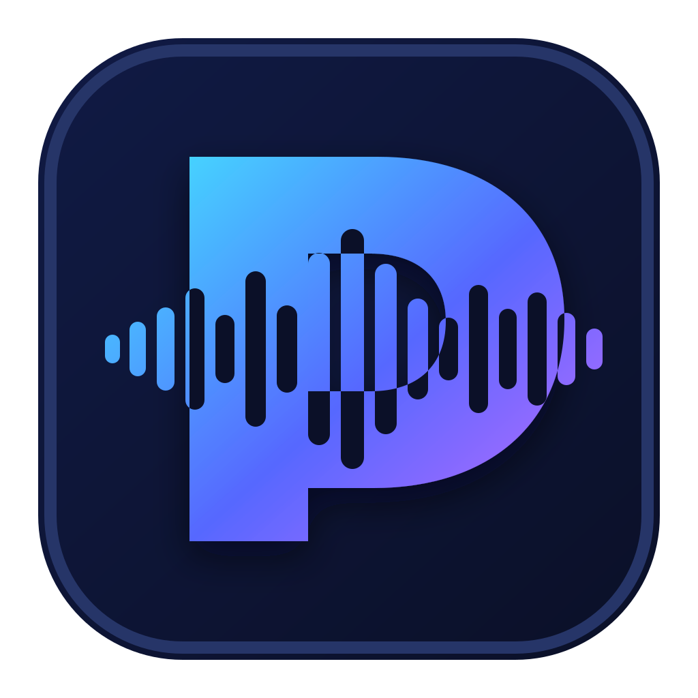

<p align="center">
  
</p>

# Pressay

Une barre de commande vocale contrôlable pour écrire et transformer du texte
depuis n’importe quelle application macOS. Pressay conserve une dictée
universelle rapide, puis ajoute des modes contextuels et des transformations
réversibles sans perdre la cible initiale.

Maintiens **Fn**, parle, relâche : le texte apparaît là où se trouve ton
curseur. Pour transformer du texte, sélectionne-le, appuie sur **⌥⇧Espace**,
dicte l’instruction et valide l’aperçu.

## Comment ça marche ?

1. L'app vit dans ta barre de menu (en haut à droite de ton écran)
2. Tu choisis un mode : Fidèle, Propre, Message, Email, Prompt IA ou un mode
   personnalisé
3. Tu maintiens la touche **Fn**, tu parles, puis tu relâches
4. Pressay transcrit et, si le mode le demande, transforme le texte
5. Le résultat est inséré dans la cible capturée au début de la session

La transformation de sélection suit un parcours plus prudent : Pressay capture
la sélection initiale, affiche Original/Proposition, puis revérifie la cible et
la sélection avant le remplacement. Si elles ont changé, le résultat est copié
au lieu d’être collé au mauvais endroit.

Le socle actuel utilise la clé OpenAI personnelle de l’utilisateur : l’endpoint
audio pour la transcription et la Responses API pour les modes de
transformation. Les moteurs locaux restent planifiés et aucun mode ne prétend
fonctionner hors ligne avant leur intégration.

## Télécharger et installer

### Prérequis

- macOS 14 (Sonoma) ou plus récent
- Une clé API OpenAI ([créer un compte ici](https://platform.openai.com/api-keys))
- Un Mac Intel ou Apple Silicon

### Étapes

1. Télécharge `Pressay.dmg` depuis la
   [dernière release](https://github.com/YoannDrx/pressay/releases/latest).
2. Ouvre le DMG et glisse **Pressay** dans **Applications**.
3. Lance Pressay depuis Applications.
4. Configure ta clé API depuis les réglages.
5. Accorde les permissions **Microphone** et **Accessibilité** demandées par macOS.

La release publique est signée avec un certificat Developer ID, notarialisée par
Apple et distribuée sous la forme d'un binaire universel `arm64 + x86_64`. Tu peux
vérifier le téléchargement avec le fichier `Pressay.dmg.sha256` publié à côté du
DMG.

La page de téléchargement publique est également disponible sur
[yoann-andrieux.fr](https://www.yoann-andrieux.fr/fr/projects/pressay). La
version stable publiée est `v1.2.1` ; les utilisateurs ayant activé le canal
bêta recevront aussi cette version stable.

### Compiler depuis les sources

1. **Clone le dépôt**
   ```bash
   git clone https://github.com/YoannDrx/pressay.git
   cd pressay
   ```

2. **Ouvre le projet dans Xcode**
   ```bash
   open Pressay.xcodeproj
   ```

3. **Compile et lance** (Cmd + R)

4. **Configure ta clé API**
   - Clique sur l'icône Pressay dans la barre de menu
   - Va dans les réglages
   - Entre ta clé API OpenAI (commence par `sk-...`)

5. **Accorde les permissions**
   - **Microphone** : pour enregistrer ta voix
   - **Accessibilité** : pour coller le texte automatiquement

Une compilation locale nécessite Xcode. Les builds de développement déjà
installées sous les anciens identifiants `com.hyrak.whisper` ou
`fr.yodev.whisper` devront réaccorder une fois les permissions Microphone et
Accessibilité après le passage à `fr.yodev.pressay`. Les préférences, la clé API,
la clé de l'historique chiffré et le dossier `Application Support/Whisper` sont
migrés automatiquement au premier lancement.

## Mises à jour

Pressay utilise Sparkle 2.9.2. L'application propose d'activer la vérification
automatique au second lancement, et le menu contient l'action
**Rechercher les mises à jour…**. Chaque mise à jour est une application complète
dans un DMG notarialisé et signé avec une clé Ed25519 dédiée.

Pressay n'envoie ni profil système ni télémétrie à Yodev. Le flux stable et les
items bêta optionnels partagent l’appcast canonique
`https://yoanndrx.github.io/pressay/appcast.xml`. Les versions bêta sont
désactivées par défaut.

## Lancer Pressay au démarrage du Mac

Pour que Pressay se lance automatiquement quand tu allumes ton Mac :

1. Ouvre **Réglages Système**
2. Va dans **Général** > **Ouverture**
3. Clique sur le **+** en bas de la liste
4. Cherche et sélectionne **Pressay** dans tes Applications
5. C'est bon !

Maintenant Pressay sera toujours prêt à t'écouter dès que tu démarres ton Mac.

## Fonctionnalités

### Transcription instantanée
Maintiens **Fn**, parle, relâche. Le texte apparaît. Simple.

### Historique privé
L'historique est optionnel, chiffré sur le Mac avec AES-256-GCM et peut être
conservé 24 heures, 7 jours ou 30 jours.

- Clique sur l'icône dans la barre de menu
- Sélectionne "Historique"
- Clique sur une transcription pour la copier

Il se nettoie automatiquement et sa désactivation efface le fichier local.

### Feedback audio
Un petit son te confirme quand l'enregistrement commence et quand la transcription est prête.

### Protection contre les transcriptions fantômes
L'app mesure le niveau audio localement. Si aucune parole n'est détectée, le fichier n'est pas envoyé à l'API et aucun texte n'est collé.

### Reconnaissance personnalisable
Dans les préférences, tu peux choisir le français, l'anglais ou la détection automatique, puis ajouter les noms propres et acronymes que tu utilises souvent.

### Dictée flexible
Le raccourci peut être Fn/Globe, Option droite ou Commande droite. Le mode
« Maintenir » convient aux messages courts ; le mode « Bascule » permet les longues
dictées. Une double pression active la capture mains libres. Un HUD discret
indique le niveau micro, la durée, la langue, le mode et la file.

### File d'attente et annulation
Tu peux commencer une nouvelle dictée pendant que la précédente est transcrite.
Chaque résultat conserve l'application cible d'origine, et l'appel en cours peut
être annulé avec Échap ou depuis le HUD. Après une insertion compatible, le HUD
propose une annulation locale pendant quelques secondes.

### Modes contextuels

Pressay inclut douze modes natifs : Fidèle, Propre, Message, Email, Prompt IA,
Note, Compte rendu, Ticket, Commit, Traduction, Résumé et Tâches. L’éditeur de
modes permet de définir un prompt, un format, un niveau de nettoyage et les
sources de contexte autorisées. Une règle par bundle ID peut choisir
automatiquement un mode pour chaque application.

### Transformation de sélection

Le raccourci **⌥⇧Espace** capture la sélection par l’API Accessibilité ou, si
nécessaire, par un `Cmd+C` temporaire dont le presse-papiers est restauré. La
parole est traitée comme l’instruction ; la sélection et le contexte restent des
données passives non fiables. Le remplacement n’a lieu qu’après validation de
l’aperçu et nouvelle vérification de l’élément ciblé.

### Contexte et cloud visibles

Chaque mode autorise explicitement ses sources de contexte. Avant un traitement
cloud, Pressay affiche le mode, le fournisseur, le modèle et le contenu exact
des sources réellement transmises. Les champs sécurisés sont bloqués avant le
démarrage du micro. La politique `askBeforeCloud` exige un choix explicite à
chaque session ; l’utilisateur peut envoyer, annuler ou conserver la
transcription brute lorsque ce choix est compatible avec l’intention.

## Permissions requises

L'app a besoin de ces permissions pour fonctionner :

| Permission | Pourquoi ? |
|------------|-----------|
| **Microphone** | Pour enregistrer ta voix |
| **Accessibilité** | Pour coller le texte automatiquement dans n'importe quelle app |

## Clé API OpenAI

Tu as besoin d'une clé API OpenAI pour utiliser Pressay :

1. Va sur [platform.openai.com/api-keys](https://platform.openai.com/api-keys)
2. Crée un compte ou connecte-toi
3. Crée une nouvelle clé API
4. Copie la clé (elle commence par `sk-...`)
5. Colle-la dans les réglages de Pressay

**Note** : Le téléchargement de Pressay est gratuit, mais l'utilisation de l'API
OpenAI peut être facturée directement par OpenAI. Consulte les
[tarifs OpenAI](https://openai.com/api/pricing/) pour les prix actuels.

Ta clé API est stockée de façon sécurisée dans le Keychain de macOS (le même endroit où sont stockés tes mots de passe).

## Comment ça fonctionne techniquement ?

1. `ShortcutRouter` demande au `SessionCoordinator` de créer une `VoiceSession`.
2. La cible AX, la sélection et les seules sources de contexte autorisées sont
   capturées avant l’enregistrement.
3. L’audio M4A 16 kHz mono est analysé localement ; le silence n’est pas envoyé.
4. `TranscriptionService` produit le texte brut via l’endpoint audio OpenAI.
5. Le mode résolu choisit entre restitution fidèle et transformation via la
   Responses API avec `store: false`.
6. Une transformation de sélection attend un aperçu éditable.
7. `TextInjector` revérifie l’application, l’élément et le hash de sélection ;
   il insère ou copie le résultat si la cible n’est plus sûre.
8. Le presse-papiers précédent est restauré sauf modification concurrente, et
   une insertion AX compatible reçoit un jeton d’annulation temporaire.

Les types de domaine et les frontières de services sont détaillés dans
[ARCHITECTURE.md](ARCHITECTURE.md).

## Confidentialité

- **Audio** : envoyé à OpenAI uniquement lorsqu'une voix est détectée, puis supprimé localement
- **Transformation** : le texte et les sources autorisées sont envoyés à OpenAI
  uniquement pour un mode non fidèle ; la requête désactive le stockage de
  réponse avec `store: false`
- **Contexte** : capturé à la demande, limité, jamais surveillé en continu ; les
  sources utilisées sont affichées par Pressay
- **Champs sécurisés** : capture refusée avant l’enregistrement
- **Clé API** : Stockée dans le Keychain macOS (chiffré)
- **Historique** : Optionnel, chiffré localement, rétention configurable
- **Modes** : enregistrés localement avec des permissions de fichier limitées à
  l’utilisateur
- **Métriques** : Optionnelles et locales, durées agrégées uniquement
- **Aucune télémétrie distante** : aucune donnée n'est envoyée à l'auteur du projet
- **Mises à jour** : aucun profil système n'est joint aux requêtes Sparkle

Consulte la [politique de confidentialité](PRIVACY.md), le [plan de
test](TESTING.md) et le [guide de distribution](DISTRIBUTION.md).

Pressay par Yodev est une application indépendante utilisant l'API OpenAI. Elle
n'est ni éditée ni approuvée par OpenAI.

## Roadmap

L’état exact du code et la vision produit — moteurs locaux, wedge développeur,
Voice Inbox, mémoire, actions contrôlées, intégrations, Pressay Pro, réunions et
App Intents — sont détaillés dans [ROADMAP.md](ROADMAP.md). Chaque version
possède son propre gate de tests, sécurité, accessibilité, confidentialité et
mise à jour depuis la version publique précédente.

## Contribuer

Les PRs sont les bienvenues ! Si tu trouves un bug ou tu as une idée de feature, ouvre une issue.

## Licence

MIT - Fais-en ce que tu veux !
