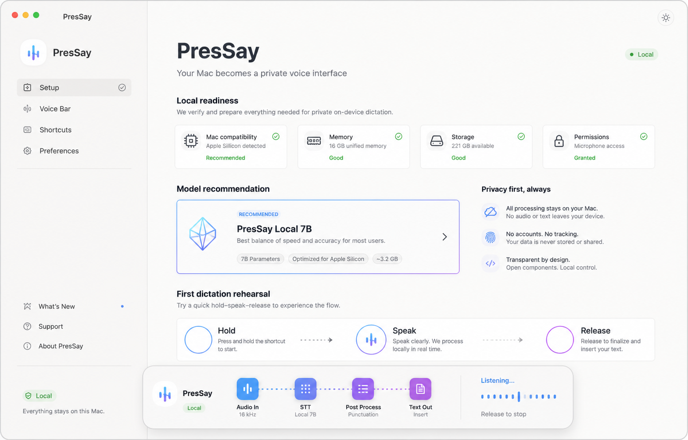
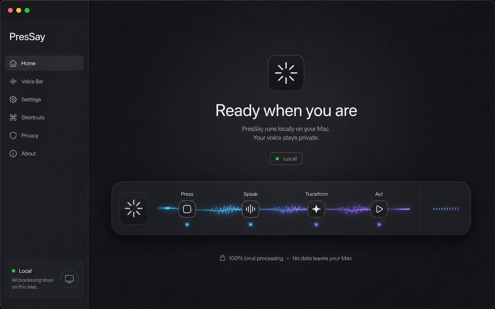

# Direction artistique — Signal OS

## Intention

Signal OS rend visible le passage `pression → signal → sens → action`. L'identité doit évoquer un instrument macOS précis, calme et fiable, pas un tableau de bord SaaS ni une copie des concurrents.

La couleur n'est pas un décor : elle matérialise une énergie active, une route ou une transition. Au repos, Pressay est essentiellement neutre. Pendant l'écoute et le traitement, le signal apparaît puis se résorbe.

## Deux explorations

### A — Mineral Light

Piste native, lumineuse et pédagogique. Elle est adaptée à l'onboarding, aux réglages et aux états où la compréhension prime. À retenir : espace, lisibilité, diagnostic en ligne, progression Hold/Speak/Release et route Local explicite.

À corriger avant production : le modèle « Local 7B » est fictif et ne correspond pas au catalogue Pressay ; la densité de cartes est trop SaaS ; la couleur verte ne doit pas devenir l'identité principale ; toute copie devra passer par l'i18n. Cette image est une exploration d'atmosphère, pas une spécification d'écran.

### B — Obsidian Instrument

Piste cinématique et instrumentale. Elle rend le cycle Press/Speak/Transform/Act tangible et installe la Voice Bar comme cœur du produit. À retenir : retenue chromatique, signal linéaire, grande surface calme et statut Local.

À corriger avant production : la sidebar n'est pas nécessaire pour le dashboard final ; la barre doit rester compacte hors démonstration ; chaque étape ne doit pas suggérer qu'un LLM ou une action système est toujours utilisé.

## Direction finale

Les deux pistes ne deviennent pas deux thèmes concurrents. La direction finale utilise la matière sombre pour les surfaces transversales — Voice Bar, hero et moments d'écoute — et la clarté minérale pour l'apprentissage, les réglages et les contenus longs. Light et dark restent pleinement disponibles.

### Palette sémantique proposée

Les valeurs sont un point de départ à valider en contraste et sur écrans P3/sRGB.

| Token              | Light                   | Dark                 | Usage                                            |
| ------------------ | ----------------------- | -------------------- | ------------------------------------------------ |
| `surface.canvas`   | `#F5F5F2`               | `#0C0E11`            | Fond principal.                                  |
| `surface.panel`    | `#FFFFFF`               | `#14171B`            | Fenêtres, popovers.                              |
| `surface.raised`   | `#ECEDE9`               | `#1C2025`            | Contrôle actif, Voice Bar.                       |
| `surface.overlay`  | `rgba(255,255,255,.82)` | `rgba(20,23,27,.86)` | Matériau translucide.                            |
| `text.primary`     | `#17191C`               | `#F4F5F2`            | Texte principal.                                 |
| `text.secondary`   | `#5F646B`               | `#A8AEB6`            | Aide et métadonnées.                             |
| `text.tertiary`    | `#858B93`               | `#747B84`            | États inactifs.                                  |
| `signal.primary`   | `#2E9BFF`               | `#64C7FF`            | Capture/écoute.                                  |
| `signal.transform` | `#715CFF`               | `#9A8CFF`            | Transformation demandée.                         |
| `signal.action`    | `#B640FF`               | `#D37BFF`            | Action confirmée.                                |
| `success`          | `#168B50`               | `#55D58B`            | Succès, jamais seule information.                |
| `warning`          | `#A86700`               | `#F2B84B`            | Action requise/récupérable.                      |
| `danger`           | `#C33B38`               | `#FF7770`            | Échec/annulation sensible.                       |
| `route.local`      | `#168B50`               | `#55D58B`            | Local STT.                                       |
| `route.apple`      | `#59636F`               | `#C9D0D8`            | Apple Intelligence.                              |
| `route.byok`       | `#715CFF`               | `#9A8CFF`            | Fournisseur personnel.                           |
| `route.cloud`      | `#B06A00`               | `#FFC05C`            | Pressay Cloud, volontairement distinct du local. |

Règles : ratio WCAG AA minimum ; motifs/labels en plus de la couleur ; gamut sRGB garanti ; contraste renforcé désactive transparence et gradients.

### Typographie

- Produit : SF Pro via la stack système, pour une intégration macOS et toutes les langues prises en charge.
- Marque/landing : une grotesque propriétaire ou licenciée seulement si elle couvre Latin étendu et n'alourdit pas le bundle ; sinon SF Pro Display.
- Technique : SF Mono pour raccourcis, routes, modèles, durées et diagnostics.
- Aucun texte critique dans un canvas, une image ou une scène 3D.

### Grille et forme

- Unité de base : 4 px ; grille d'interface : 8 px.
- Largeurs préférées : contrôles 28/32/36 px, Voice Bar 44 px compacte et 64 px développée.
- Rayons : 8 px contrôles, 12 px panneaux, 18–22 px surfaces flottantes ; pas de pilules partout.
- Bordure : 1 px à faible contraste ; élévation courte et diffuse, jamais plusieurs ombres décoratives.
- Matériau translucide réservé à la Voice Bar et aux popovers système ; contenu long sur surface opaque.

### Motif et iconographie

Le glyphe de marque est un signal radial/linéaire réduit à cinq ou sept segments. Il doit fonctionner comme template macOS monochrome à 16 px. Les variations ne changent pas de métaphore ; elles modifient ouverture, densité et direction.

- repos : segments courts et fermés ;
- écoute : ouverture latérale + amplitude ;
- transcription : segments qui convergent ;
- transformation : nœud central, sans symbole « magie » générique ;
- insertion : signal orienté vers un curseur ;
- succès : forme résolue pendant 350–500 ms ;
- erreur : discontinuité visible, pas seulement rouge.

Les assets finaux doivent être dessinés en vectoriel, inspectés pixel par pixel et exportés comme macOS template images. Les explorations raster de ce dossier ne sont pas des sources d'icônes.

## Motion system

| Moment       | Mouvement                                | Durée cible    | Reduced motion                |
| ------------ | ---------------------------------------- | -------------- | ----------------------------- |
| Apparition   | Scale 0.98 → 1 et opacity                | 140 ms         | Opacity 80 ms.                |
| Arming       | Segments s'alignent                      | 80–120 ms      | Changement immédiat.          |
| Listening    | Waveform pilotée par niveau RMS, amortie | Temps réel     | 3 niveaux discrets.           |
| Captured     | Onde se compacte                         | 120 ms         | Label « Captured ».           |
| Transcribing | Balayage unidirectionnel lent            | Boucle max 1 s | Ellipse non animée + timer.   |
| Transforming | Nœuds réordonnés, teinte dédiée          | 220 ms         | Changement de label/couleur.  |
| Inserting    | Signal se dirige vers curseur            | 120 ms         | Icône + label.                |
| Success      | Résolution et fade                       | 350–500 ms     | Confirmation statique 500 ms. |
| Error        | Discontinuité sans shake agressif        | 160 ms         | Icône/texte statiques.        |

Les sons sont courts, facultatifs et distincts : arming, capture, succès et erreur. Ils ne remplacent aucun retour visuel ou VoiceOver.

## Onboarding cible

Le flux est une machine reprenable. Chaque étape persiste uniquement son succès ; un refus ou une fermeture ramène à l'action nécessaire sans perdre les étapes précédentes.

| Étape | Écran              | Action principale                                                                             | Erreur/récupération                                                       | Événement de succès          |
| ----- | ------------------ | --------------------------------------------------------------------------------------------- | ------------------------------------------------------------------------- | ---------------------------- |
| 1     | Bienvenue          | Comprendre en un regard : local, hors ligne, sans compte, puis démarrer.                      | Aucun compte, choix Cloud ou diagnostic détaillé proposé.                 | Intention de démarrer.       |
| 2     | Préparation du Mac | Autoriser microphone et accessibilité sur la même surface, puis charger le modèle recommandé. | Ouverture du réglage exact, retest au focus, modèle alternatif dépliable. | Permissions et modèle prêts. |
| 3     | Première dictée    | Maintenir le raccourci, parler, relâcher et voir le texte inséré dans le sandbox.             | Réessayer ou terminer et tester plus tard.                                | Texte inséré ou skip choisi. |

Le diagnostic matériel reste exécuté silencieusement pour calculer la recommandation. Le réglage du raccourci, la personnalisation et la découverte Pro restent disponibles dans l'app mais ne retardent plus le premier succès.

Critères mesurables : médiane de premier succès < 4 minutes hors téléchargement ; aucun modèle requis à comprendre pour continuer ; refus de permission sans impasse ; reprise après relance ; Cloud jamais présélectionné.

## Landing immersive

La landing raconte l'architecture réellement livrée :

1. Hero « Your Mac, now speaks your language » : touche abstraite + signal réactif, une scène 3D maximum.
2. Séquence sticky `Press → Speak → Transform → Act` ; « Transform » et « Act » apparaissent seulement avec un exemple compatible.
3. Voice Bar dans Mail, Slack, Cursor et Notes, avec captures produites depuis une build validée.
4. Carte des routes Local, Apple Intelligence, BYOK, Cloud ; clic pour voir exactement les données et prérequis.
5. Commandes de texte et correction vocale avec avant/après.
6. Modes, profils et dictionnaire.
7. Fast/Polyglot/Precise avec chiffres issus du benchmark matériel, jamais estimations marketing non signalées.
8. Preuves de confidentialité vérifiables.
9. Free/Pro et canal d'achat approprié.
10. FAQ et téléchargement.

Budgets : LCP < 2,5 s, CLS < 0,1, INP < 200 ms et 60 fps sur MacBook Air de référence. Scène 3D chargée après contenu critique, images responsives, fallback statique pour GPU faible/mobile/reduced motion. Aucun autoplay lourd au-dessus du fold.

Le dépôt de landing n'étant pas présent ici, les composants, framework, CMS, déploiement et instrumentation devront être audités avant estimation fichier par fichier.

## Internationalisation et accessibilité

- Tester les 23 langues existantes, pseudo-localisation à +40 % et au moins un cas RTL.
- Aucun layout fondé sur une largeur de mot fixe.
- Zoom texte et système à 200 %, Dynamic Type macOS quand applicable.
- Ordre VoiceOver : phase → route → mode → application → action.
- Waveform décorative masquée à l'accessibilité ; timer annoncé sans bruit excessif.
- Raccourcis exprimés textuellement et graphiquement.
- Mode contraste renforcé opaque ; mode reduced motion sans mouvement continu.

## Processus de verrouillage DA

1. Refaire les deux explorations dans Figma avec vrais contenus et contraintes macOS.
2. Tester onboarding et Voice Bar en prototype cliquable avec 5 nouveaux utilisateurs et 5 power users.
3. Choisir une seule grammaire de marque et valider les tokens en light/dark/contrast.
4. Produire la bibliothèque de composants et les glyphes vectoriels.
5. Tester FR/EN, textes longs, RTL, VoiceOver et reduced motion avant intégration.
