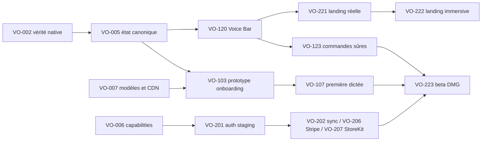

# Validation, risques et backlog

## Mise à jour après implémentation — 17 août 2026

Clôturés en source : VO-003 (suite Rust exécutable), VO-004 (routes explicites), VO-005 (état canonique), VO-006 (matrice et guards compilables), VO-101/102 (tokens et glyphes Signal OS), VO-104 (diagnostic), VO-106/107 (exercice et sandbox), VO-120/121/122 (Voice Bar, erreurs, tray), VO-123/124 (commandes déterministes et snippets), VO-220 (dépôt landing audité) et l’implémentation de VO-222. Les tests frontend couvrent désormais FR chargé à la demande, RTL et reduced motion ; le bundle initial ne contient plus les 23 catalogues.

Partiellement prouvés : VO-007 valide les routes de marque/fallback, les hashes
et les trois modèles sur M2 16 Go, mais la route de marque n’est pas encore une
origine CDN indépendante ; VO-201 passe seulement les probes staging publics ;
VO-204 dispose d’un harness sans comptes fournisseurs ; VO-222 attend encore
les Core Web Vitals d’un déploiement Preview.

Toujours externes : VO-002, tests novices de VO-103, matrices natives DMG/MAS, M1 8 Go, Apple Intelligence, comptes BYOK, auth/sync à deux appareils, Stripe Test Clocks, StoreKit Sandbox/TestFlight, revue sécurité et traduction humaine hors FR/EN. Le protocole exécutable et le format de preuve sont dans [`RELEASE_GATE_RUNBOOK.md`](RELEASE_GATE_RUNBOOK.md).

## Mise à jour UI et authentification — 18 août 2026

- Signal OS est appliqué aux headers, atmosphères, cartes de réglages, modèles, historique, compte et post-traitement.
- Les champs, sélecteurs, raccourcis, boutons de réinitialisation et toggles utilisent désormais les mêmes états focus/actif bleus.
- La recherche Historique occupe toute la largeur disponible.
- Les chemins de données et journaux ont quitté « À propos » et restent accessibles uniquement dans Avancé > Expérimental pour le support.
- « À propos » expose la Signal Orb et la signature YoDev.
- Les anciennes installations bêta qui pointaient vers l'API commerciale historique migrent vers le control plane staging compatible ; la suite desktop compte 308 tests passants et le backend Cloud 90. Huit probes publics valident aussi la santé, la base, la configuration auth, Apple, l’issuer OAuth PKCE, la clé publique d'entitlements et les frontières d'authentification.

Gate encore ouverte : rejouer Google dans le binaire installé, puis valider la migration de données et le rollback avant tout cutover de `api.press-say.app`. Tant que cette gate n'est pas fermée, le produit ne doit pas être annoncé comme « 100 % commercialisable », même si la dictée locale reste pleinement indépendante du compte.

## Définition de « fonctionnel à 100 % »

Une capability ne passe à `validée` que si :

- son comportement relie l'UI au backend réel ;
- succès, erreurs, annulation et reprise sont couverts ;
- un test automatisé au bon niveau existe ;
- un test natif représentatif passe ;
- sa route et ses implications de confidentialité sont documentées ;
- elle fonctionne sur DMG et MAS, ou porte explicitement une contrainte de canal ;
- les métriques de latence/mémoire pertinentes respectent un budget défini.

Le propriétaire du feature ledger attache la preuve — run CI, vidéo/capture redacted, appareil/OS, backend et version — au changement de statut.

## Stratégie de validation

### Automatisé

| Couche           | Couverture minimale                                                                                 |
| ---------------- | --------------------------------------------------------------------------------------------------- |
| Rust unitaires   | Transitions pipeline, annulation, routes, redaction, capabilities, entitlement, crypto, merge sync. |
| Rust intégration | Audio fixtures, modèle mock, provider HTTP mock, Keychain abstrait, fichiers chiffrés/corrompus.    |
| Contrats         | Auth, Cloud, tous providers BYOK, Stripe webhooks et validation StoreKit serveur.                   |
| React unitaires  | Mapping état → Voice Bar/tray model, actions récupérables, paywall/capability guards.               |
| Playwright       | Onboarding, réglages, modes, dictionnaire, compte, paywall, offline et erreurs simulées.            |
| Visuel           | Light/dark/contrast, FR/EN, pseudo-localisation longue, RTL, reduced motion.                        |
| Performance      | Startup, cold model load, temps press→arming, release→insert, RAM/CPU/énergie.                      |

Tests de correspondance obligatoires : pour chaque événement `VoiceSurfaceState`, snapshot de la Voice Bar et identifiant de glyphe tray attendus. La logique tray native peut consommer un modèle de présentation testé sans rendre une image.

### Matrice matérielle

| Classe                                   | OS                                    | Rôle                                                    |
| ---------------------------------------- | ------------------------------------- | ------------------------------------------------------- |
| M1 8 Go                                  | macOS 14                              | Cible minimale, pression mémoire et performance locale. |
| Mac médian                               | Version macOS intermédiaire supportée | Comportement courant et multi-apps.                     |
| Mac récent compatible Apple Intelligence | macOS 26+                             | Route Apple Intelligence et performance maximale.       |

Chaque machine teste build DMG ; les capacités compatibles sont aussi testées dans le build MAS signé. Conserver température/énergie ambiante comparable pour les benchmarks longs.

### Applications et scénarios natifs

Applications : Mail, Messages, Notes, Safari, Chrome, Slack, Notion, Word, Cursor, Terminal et champs sécurisés.

Pour chacune : hold/release, toggle, annuler capture, annuler traitement, texte court/long, multilingue, sélection/réécriture si compatible, insertion, presse-papiers riche, focus changé. Les champs sécurisés doivent refuser proprement toute capture de sélection/insertion non autorisée.

Scénarios transversaux : micro débranché, silence, permission refusée, modèle absent/corrompu, téléchargement interrompu, disque plein, offline complet, provider 401/429/timeout, Cloud indisponible, backend compte indisponible, écran externe retiré et relance après crash.

## Budgets produit initiaux

À ajuster après mesure, mais à définir avant optimisation :

| Mesure                                        | Cible initiale                                         |
| --------------------------------------------- | ------------------------------------------------------ |
| Touche → état arming                          | p95 < 100 ms                                           |
| Arming → waveform                             | p95 < 200 ms                                           |
| Release → début transcription                 | p95 < 150 ms                                           |
| Texte court release → insertion, Fast M1 8 Go | médiane < 1,5 s, p95 < 3 s                             |
| Voice Bar frame rate                          | 60 fps, aucune animation > 16,7 ms p95                 |
| Mémoire M1 8 Go                               | Pas de pression rouge ni swap croissant sur 20 dictées |
| Crash-free sessions beta                      | > 99,5 % avant élargissement                           |
| Landing LCP/CLS/INP                           | < 2,5 s / < 0,1 / < 200 ms                             |

Les chiffres STT/LLM publiés doivent provenir du même protocole et identifier modèle, machine, langue, longueur et percentile.

## Backlog priorisé

### P0 — vérité produit et fondations

| ID     | Travail                                                   | Dépend de              | Critère d'acceptation                                                             | Risque                                      |
| ------ | --------------------------------------------------------- | ---------------------- | --------------------------------------------------------------------------------- | ------------------------------------------- |
| VO-001 | Transformer ce ledger en registre maintenu par CI/release | Aucun                  | Propriétaire, preuve et date pour chaque capability ; aucune annonce sans statut. | Faible                                      |
| VO-002 | Harness de test natif dictée/insertion                    | Appareils de référence | Matrice de 11 apps exécutable, résultats versionnés et redacted.                  | Élevé : automatisation macOS/accessibilité. |
| VO-003 | Stabiliser tests Rust/CI et budget disque                 | CI/cache               | `cargo test` atteint l'exécution sur clean runner sans saturation.                | Moyen                                       |
| VO-004 | Introduire `ProcessingRoute`                              | Aucun                  | Route explicite dans backend/bindings/UI ; aucun fallback silencieux.             | Moyen : migration settings.                 |
| VO-005 | Introduire `VoiceSurfaceState` canonique                  | VO-004                 | Overlay et tray consomment le même événement ; toutes transitions unit-tested.    | Élevé : courses existantes.                 |
| VO-006 | Centraliser `Capabilities`                                | Architecture Free/Pro  | Guards frontend/backend identiques ; entitlement atomique ; Free offline intact.  | Élevé : sécurité/paywall.                   |
| VO-007 | Benchmark modèles/CDN                                     | CDN réel + 3 Macs      | Fast/Polyglot/Precise téléchargés, checksum, reprise, WER/latence/RAM documentés. | Élevé : artefacts/licences/perf.            |

### P1 — Signal OS et premier succès

| ID     | Travail                               | Dépend de                   | Critère d'acceptation                                                             | Risque                    |
| ------ | ------------------------------------- | --------------------------- | --------------------------------------------------------------------------------- | ------------------------- |
| VO-101 | Tokens Signal OS partagés app/overlay | Direction Figma validée     | Light/dark/contrast, aucun token brut dans composants pilotes.                    | Moyen                     |
| VO-102 | Famille de glyphes marque/menu bar    | VO-005, direction validée   | Tous états à 16 pt template, tests light/dark/contrast, zéro asset Handy.         | Moyen                     |
| VO-103 | Prototype onboarding testable         | VO-007, DA                  | 5 novices atteignent première dictée sans aide ; refus permission récupérable.    | Moyen                     |
| VO-104 | Diagnostic local                      | VO-007                      | Puce/RAM/disque/OS, recommandation explicable, aucun identifiant sensible.        | Faible                    |
| VO-105 | Permissions séparées et reprenables   | VO-103                      | Micro puis accessibilité ; ouvrir Réglages/retest ; aucune impasse.               | Élevé : variantes OS/MAS. |
| VO-106 | Exercice du geste réel                | VO-005                      | Hold/speak/release/cancel détectés sans insertion externe.                        | Moyen                     |
| VO-107 | Première dictée sandbox               | VO-105, VO-106, modèle prêt | Capture/STT/insertion réelle dans champ ; reprise par étape ; succès persisté.    | Élevé                     |
| VO-108 | Refonte coque/réglages                | VO-101, tests prototypes    | Hiérarchie instrumentale, fonctionnalités existantes préservées, i18n 23 langues. | Moyen                     |

### P1 — Voice Bar et commandes sûres

| ID     | Travail                                | Dépend de                           | Critère d'acceptation                                                                | Risque |
| ------ | -------------------------------------- | ----------------------------------- | ------------------------------------------------------------------------------------ | ------ |
| VO-120 | Voice Bar phases principales           | VO-005, VO-101                      | Hidden→success, pas de focus, multi-écrans, 60 fps, reduced motion.                  | Élevé  |
| VO-121 | Erreurs et actions de reprise          | VO-120                              | Les 8 codes définis offrent une action valide ; aucune route externe silencieuse.    | Moyen  |
| VO-122 | Mapping tray complet                   | VO-005, VO-102                      | 1:1 avec Voice Bar sur 100 cycles rapides.                                           | Moyen  |
| VO-123 | Parseur commandes déterministes        | VO-005                              | New line/list/cancel/mode ; corpus multilingue, échappement et faux positifs bornés. | Moyen  |
| VO-124 | Snippets contrôlés                     | VO-123, Capabilities                | Preview, expansion, collision et secret policy testés.                               | Moyen  |
| VO-125 | Correction du dernier résultat         | VO-004, VO-120                      | Original récupérable, diff/preview, route visible et annulation sûre.                | Élevé  |
| VO-126 | Formats liste/email/message            | VO-123 puis routes LLM facultatives | Règles locales quand possible ; fallback explicite ; tests multilingues.             | Moyen  |
| VO-127 | Résumé/traduction/réécriture sélection | VO-004, BYOK/Apple gates            | Preview, consentement route, sélection sensible et paste failure couverts.           | Élevé  |

### P2 — durcissement services

| ID     | Travail                        | Dépend de                       | Critère d'acceptation                                                             | Risque          |
| ------ | ------------------------------ | ------------------------------- | --------------------------------------------------------------------------------- | --------------- |
| VO-201 | Auth staging production-shaped | Backend disponible              | Matrice auth complète, audience/appareil et offline grace validés.                | Élevé           |
| VO-202 | Sync E2EE opératoire           | VO-201                          | Tous scénarios CLOUD_SYNC + allowlist négative passent.                           | Très élevé      |
| VO-203 | Revue sécurité externe         | VO-202                          | Aucun finding critique/élevé ouvert ; décisions documentées.                      | Très élevé      |
| VO-204 | Provider contract suite        | Mocks + comptes de test         | Tous providers passent erreurs/compatibilité/redaction ; statut ledger actualisé. | Élevé           |
| VO-205 | Route Apple Intelligence       | Matériel/OS compatible          | Disponibilité, langues, consentement et aucun faux fallback.                      | Élevé : API/OS. |
| VO-206 | Stripe DMG                     | VO-006, VO-201, backend billing | Checkout, webhooks idempotents, clocks, portail, suppression compte.              | Très élevé      |
| VO-207 | StoreKit MAS                   | VO-006, VO-201, profil Apple    | Configuration, Sandbox, validation serveur, restore et TestFlight.                | Très élevé      |
| VO-208 | Audit historique/privacy       | Revue externe                   | Default off, chiffrement/migrations/nettoyage/logs/sync vérifiés.                 | Élevé           |

### P2 — landing et beta

| ID     | Travail                       | Dépend de                 | Critère d'acceptation                                                         | Risque                  |
| ------ | ----------------------------- | ------------------------- | ----------------------------------------------------------------------------- | ----------------------- |
| VO-220 | Obtenir/auditer dépôt landing | Accès dépôt/déploiement   | Stack, ownership, analytics, budgets et plan fichier par fichier connus.      | Bloquant externe        |
| VO-221 | Prototype narration immersive | VO-120, DA, dépôt landing | Test utilisateur, fallback statique, aucune promesse non validée.             | Moyen                   |
| VO-222 | Implémenter landing           | VO-220, VO-221, ledger    | Budgets Core Web Vitals, reduced motion, contenu lié aux statuts release.     | Élevé : performance 3D. |
| VO-223 | Beta privée DMG               | P0/P1, gates critiques    | Matrice native, crash-free target, privacy/release checklist passées.         | Élevé                   |
| VO-224 | Décision MAS séparée          | VO-207, spike MAS         | Capabilities runtime + TestFlight ; go/no-go documenté indépendamment du DMG. | Élevé                   |

### P3 — spikes sans engagement

| ID     | Travail                          | Dépend de                          | Critère de décision                                                | Risque     |
| ------ | -------------------------------- | ---------------------------------- | ------------------------------------------------------------------ | ---------- |
| VO-301 | Petit LLM local MLX vs llama.cpp | Bench STT stable                   | Coexistence M1 8 Go, cold start, RAM/tokens/s/énergie acceptables. | Très élevé |
| VO-302 | Transcription fichiers locale    | Modèles stables                    | Formats prioritaires, progression/reprise, temps long et export.   | Moyen      |
| VO-303 | Diagnostic audio local           | Corpus/matériel                    | Recommandation explicable sans upload, valeur démontrée en test.   | Moyen      |
| VO-304 | Actions macOS allowlistées       | Voice Bar V1 mature + threat model | Registre, preview, confirmations, aucune exécution arbitraire.     | Très élevé |

## Chemin critique

La landing n'est pas nécessairement bloquante pour une beta produit, mais elle est bloquée pour publier des démonstrations fidèles de la nouvelle Voice Bar.

## Registre de risques

| Risque                                             | Probabilité                   | Impact   | Mitigation / signal d'arrêt                                                                  |
| -------------------------------------------------- | ----------------------------- | -------- | -------------------------------------------------------------------------------------------- |
| M1 8 Go ne supporte pas STT + LLM local            | Élevée                        | Élevé    | Spike séparé ; garder règles/Apple/BYOK/Cloud. Stop si pression mémoire/latence hors budget. |
| État overlay/tray diverge lors de courses          | Élevée                        | Élevé    | Source backend unique, operation IDs, tests de transition et stress.                         |
| Permissions/paste diffèrent DMG/MAS                | Élevée                        | Élevé    | Matrices séparées ; ne pas lier le lancement DMG au go MAS.                                  |
| Cloud/sync donne une fausse impression de sécurité | Moyenne                       | Critique | Threat model et revue externe ; allowlist négative en CI.                                    |
| Provider BYOK change d'API/modèle                  | Élevée                        | Moyen    | Contrats mockés, smoke périodique, capability par provider/model.                            |
| Paiement et entitlement se désynchronisent         | Moyenne                       | Critique | Webhooks idempotents, révision signée, reconciliation et Test Clocks.                        |
| Motion/3D dégrade accessibilité/performance        | Moyenne                       | Élevé    | Une scène, budgets automatisés, fallback, reduced motion.                                    |
| Refonte supprime des fonctions existantes          | Moyenne                       | Élevé    | Feature ledger, tests avant/après et migration progressive de coque.                         |
| 23 langues cassent la hiérarchie                   | Élevée                        | Moyen    | Pseudo-localisation, snapshots, revue humaine et layouts flexibles.                          |
| Promesse locale contredite par fallback Cloud      | Faible si architecture suivie | Critique | `ProcessingRoute` obligatoire et aucun fallback externe implicite.                           |

## Ordre de décision recommandé

1. Prouver la dictée native et les trois modèles sur le matériel cible.
2. Verrouiller `ProcessingRoute`, `VoiceSurfaceState` et `Capabilities`.
3. Tester les prototypes Signal OS/onboarding/Voice Bar avant refonte large.
4. Livrer première dictée, Voice Bar et commandes déterministes.
5. Durcir séparément compte/sync, BYOK, Stripe et StoreKit.
6. Ouvrir une beta DMG quand les gates DMG passent ; décider MAS indépendamment.
7. Construire la landing sur des captures et chiffres issus de cette beta.
8. Évaluer seulement ensuite LLM local, actions macOS et fonctions longues.

## Critère de sortie de l'investigation

L'investigation est terminée lorsque ce dossier est accepté comme source de vérité, que chaque item P0/P1 possède un propriétaire et une estimation, que les appareils/environnements de validation sont réservés, et que les décisions Free/Pro, routes, DA et périmètre Voice Bar V1 ne sont plus ambiguës. Le développement peut alors commencer par VO-002, VO-004, VO-005 et VO-007 en parallèle organisationnel.
