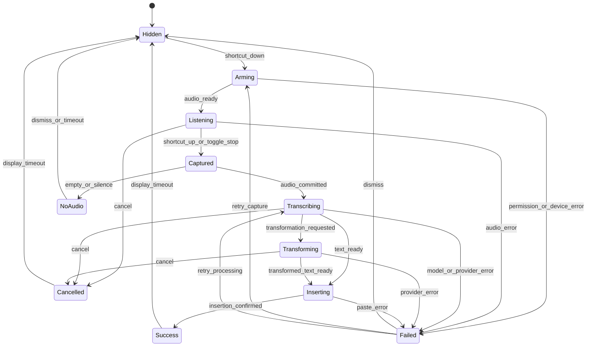

# Voice Bar — spécification fonctionnelle

## Rôle

La Voice Bar est la surface transversale de PresSay. Elle répond à cinq questions sans ouvrir l'app :

1. PresSay a-t-il reconnu ma touche ?
2. M'écoute-t-il encore ?
3. Que fait-il de ma voix ou de mon texte ?
4. Où le traitement s'effectue-t-il ?
5. Que puis-je faire si cela échoue ?

Elle n'est ni une notification ni un chat permanent. Au repos elle est cachée ; les réglages restent dans l'app principale.

## Contrats partagés à introduire

Pseudo-contrats, à matérialiser en Rust puis à générer vers TypeScript avec le mécanisme de bindings existant :

```rust
enum VoicePhase {
    Hidden,
    Arming,
    Listening,
    Captured,
    Transcribing,
    Transforming,
    Inserting,
    Success,
    Cancelled,
    Failed,
}

enum ProcessingRoute {
    LocalStt,
    AppleIntelligence,
    Byok { provider_id: String },
    PressayCloud,
}

struct VoiceSurfaceState {
    operation_id: String,
    phase: VoicePhase,
    route: ProcessingRoute,
    mode_id: Option<String>,
    target_application: Option<TargetApplicationSummary>,
    progress: Option<VoiceProgress>,
    recoverable_error: Option<VoiceSurfaceError>,
    available_actions: Vec<VoiceSurfaceAction>,
}

struct VoiceCommandIntent {
    intent: VoiceIntentKind,
    arguments: SanitizedIntentArguments,
    risk: VoiceIntentRisk,
    preview: Option<String>,
    confirmation: ConfirmationRequirement,
}
```

Interdits dans cet événement : audio, transcription complète, sélection, prompt, réponse provider, clé API ou token. `operation_id`, provider, phase, durée et code d'erreur peuvent alimenter des diagnostics locaux redacted.

La structure backend actuelle `PipelineState` fournit déjà `phase`, `operation_id`, `binding_id` et `failure`. La migration doit l'étendre ou ajouter un adaptateur unique ; elle ne doit pas créer une seconde machine d'état dans React ou `tray.rs`.

## Machine d'état



`NoAudio` est représenté côté contrat par `Failed` avec code `no_audio`, afin de garder un nombre fini de phases tout en offrant une présentation dédiée.

## Matrice des états

| État           | Forme et contenu                                                 | Icône/signal                        | Actions                                                  | Durée/transition                                  |
| -------------- | ---------------------------------------------------------------- | ----------------------------------- | -------------------------------------------------------- | ------------------------------------------------- |
| `hidden`       | Aucune fenêtre.                                                  | Tray au repos.                      | Ouvrir menu via tray.                                    | État stable.                                      |
| `arming`       | 44 px, raccourci + « Ready ».                                    | Signal fermé qui s'ouvre.           | Relâcher sans audio annule.                              | 80–120 ms, sans délai artificiel.                 |
| `listening`    | 44–64 px, waveform, timer, mode, cible, route.                   | Signal ouvert piloté par RMS.       | Annuler ; basculer mode temporaire.                      | Jusqu'au stop ; animation temps réel amortie.     |
| `captured`     | Barre compacte, « Captured ».                                    | Onde se contracte.                  | Annuler.                                                 | 120–200 ms.                                       |
| `transcribing` | Route + « Transcribing » + progression si disponible.            | Balayage convergent.                | Annuler, éventuellement copier audio local si configuré. | Jusqu'au résultat ; aucun faux pourcentage.       |
| `transforming` | Mode/commande + route + preview abrégée non sensible par défaut. | Nœud de traitement violet.          | Annuler ; « Use original » si échec.                     | Jusqu'au résultat.                                |
| `inserting`    | Application cible + « Inserting ».                               | Signal vers curseur.                | Copier si insertion échoue.                              | 120 ms minimum perceptible, pas de délai si lent. |
| `success`      | « Inserted » + route ; texte masqué.                             | Signal résolu/check abstrait.       | Undo si techniquement sûr, sinon aucune.                 | 500–800 ms puis fade.                             |
| `cancelled`    | « Cancelled ».                                                   | Signal interrompu neutre.           | Recommencer.                                             | 400 ms.                                           |
| `failed`       | Message court, code accessible et action concrète.               | Discontinuité + couleur sémantique. | Selon erreur.                                            | Persiste si action utilisateur requise.           |

Chaque état doit exposer un libellé VoiceOver unique. La route reste visible à partir de `listening` si elle est déjà déterminée, sinon dès `transcribing`.

## Erreurs récupérables

| Code                                | Message                           | Action primaire     | Action secondaire            |
| ----------------------------------- | --------------------------------- | ------------------- | ---------------------------- |
| `no_audio`                          | Aucun son détecté                 | Réessayer           | Choisir un micro             |
| `microphone_permission_required`    | Accès au micro requis             | Ouvrir Réglages     | Tester à nouveau             |
| `accessibility_permission_required` | Autoriser l'insertion             | Ouvrir Réglages     | Copier le texte              |
| `model_unavailable`                 | Modèle local indisponible         | Télécharger/charger | Choisir un modèle installé   |
| `provider_auth`                     | Clé refusée                       | Ouvrir fournisseur  | Utiliser le texte original   |
| `provider_rate_limit`               | Fournisseur temporairement limité | Réessayer plus tard | Changer de route             |
| `provider_offline`                  | Route externe inaccessible        | Réessayer           | Local sans transformation    |
| `paste_error`                       | Impossible d'insérer              | Copier              | Ouvrir réglage Accessibilité |
| `cancelled`                         | Opération annulée                 | Recommencer         | Fermer                       |

La récupération ne renvoie jamais silencieusement un texte vers une autre route externe.

## Commandes V1

### Détection

Les commandes déterministes utilisent un préfixe ou un geste configurable pour éviter d'insérer accidentellement une phrase de contrôle. Exemple conceptuel : maintien du raccourci Voice Command, puis « format as email ». La voix brute n'est jamais exécutée comme commande système.

| Intention               | Entrée                        | Résultat                  | Route minimale       | Risque                                  |
| ----------------------- | ----------------------------- | ------------------------- | -------------------- | --------------------------------------- |
| `dictate`               | Voix                          | Texte inséré              | Local STT            | Faible                                  |
| `rewrite_selection`     | Sélection + consigne          | Preview puis remplacement | Apple/BYOK/Cloud     | Moyen, confirmation si sélection longue |
| `correct_last_result`   | Dernier résultat + correction | Diff avant/après          | Règles ou LLM choisi | Faible                                  |
| `temporary_mode`        | Nom de mode                   | Mode pour une opération   | Local                | Faible                                  |
| `format_list`           | Texte                         | Liste structurée          | Règles d'abord       | Faible                                  |
| `format_email`          | Texte                         | Objet/corps/salutation    | Règles ou LLM        | Faible                                  |
| `format_message`        | Texte                         | Message concis            | Règles ou LLM        | Faible                                  |
| `summarize`             | Sélection                     | Résumé preview            | Apple/BYOK/Cloud     | Moyen                                   |
| `translate`             | Texte + langue                | Traduction preview        | Route compatible     | Moyen                                   |
| `insert_snippet`        | Identifiant snippet           | Expansion contrôlée       | Local                | Faible                                  |
| `new_line` / `new_list` | Commande parlée               | Caractère/structure       | Local déterministe   | Faible                                  |
| `cancel`                | Commande/geste                | Annulation                | Local                | Faible                                  |

Pour toute transformation, l'utilisateur peut choisir « original » si la route échoue. Les snippets ont un identifiant explicite, une preview et un échappement ; aucune expansion ne contient de secret par défaut.

## Actions V2 macOS

Registre allowlisté uniquement : ouvrir une app ou un panneau de réglage, lancer un Shortcut explicitement autorisé, navigation limitée. Chaque entrée déclare schéma d'arguments, niveau de risque, applications autorisées et confirmation.

| Risque | Exemple                                        | Confirmation                                         |
| ------ | ---------------------------------------------- | ---------------------------------------------------- |
| Faible | Ouvrir Notes                                   | Preview courte, exécution directe configurable.      |
| Moyen  | Lancer un Shortcut approuvé                    | Nom et arguments visibles ; confirmation par défaut. |
| Élevé  | Envoyer, supprimer, acheter, modifier sécurité | Hors registre V2 ou confirmation forte non vocale.   |

Les opérations irréversibles, l'exécution de shell arbitraire et les actions construites depuis du texte non fiable sont exclues.

## Menu bar

Le menu bar est un affichage du même `VoiceSurfaceState` :

| Phase                 | Glyphe template        | Animation                                  |
| --------------------- | ---------------------- | ------------------------------------------ |
| Hidden                | Signal fermé au repos  | Aucune                                     |
| Arming                | Signal entrouvert      | Une transition, pas de boucle              |
| Listening             | Signal ouvert          | 2–3 frames maximum si l'API tray le permet |
| Captured/Transcribing | Signal compacté        | Balayage discret ou alternance lente       |
| Transforming          | Nœud central           | Alternance distincte de STT                |
| Inserting             | Signal orienté curseur | Transition unique                          |
| Success               | Signal résolu          | 350–500 ms puis idle                       |
| Failed                | Signal discontinu      | Statique jusqu'à action/timeout            |

Exports : PDF/SVG source, PNG template 16×16 pt en 1×/2×/3× si requis par l'API, alpha propre, aucun gris coloré. Vérifier menu bar claire, sombre, auto-hide, écrans non-Retina et contraste renforcé.

## Fenêtre et focus

- La Voice Bar ne prend jamais le focus pendant la dictée.
- Elle suit l'écran contenant l'application cible, avec fallback écran actif.
- Elle évite le Dock, la notch et les zones sécurisées.
- Elle reste visible dans un Space plein écran selon les capacités autorisées du canal DMG/MAS.
- Aucun contenu sensible dans une capture de notification ; aperçu de texte désactivé par défaut.
- Une déconnexion d'écran repositionne la barre sans annuler l'opération.

## Critères d'acceptation V1

- Une transition backend produit exactement un état overlay et un état tray cohérents.
- 100 bascules rapides ne laissent aucune barre orpheline ni tray bloqué.
- Toutes les phases et erreurs sont testées en unitaires ; les chemins principaux le sont nativement.
- La route affichée correspond au réseau réellement utilisé.
- Annuler garantit l'absence d'insertion ultérieure.
- Offline complet préserve dictée locale, commandes déterministes et snippets.
- VoiceOver, contraste renforcé et reduced motion permettent le parcours complet.
